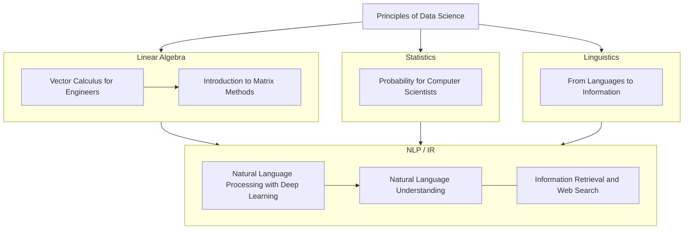

# 20250802

## Study

- LangChain Tutorial w/ Colab
    - Classification
    - Extraction

- DATASCI112: Principles of Data Science Week 4
    - [Cars and Fuel Efficiency (exercise)](https://github.com/Elnya/DATASCI112/blob/main/week4/4.2.cars-and.fuel-efficiency.ipynb)

# Next week

## Study

- DATASCI112 Week 5

# Roadmap to ML (NLP ver.)

