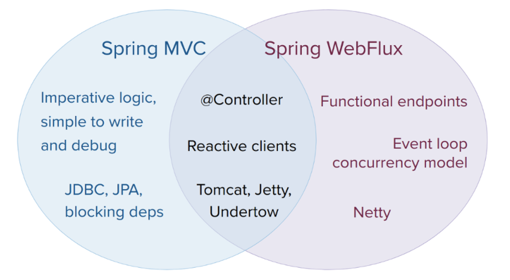
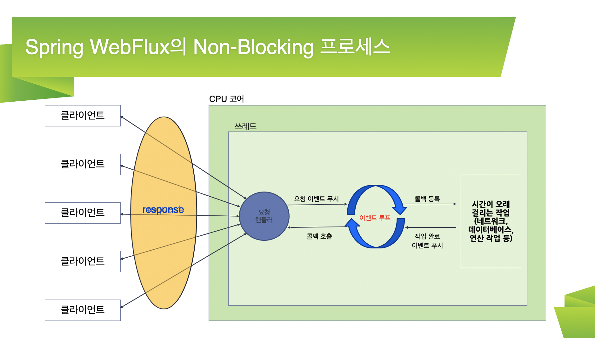

# 20260207

## Spring web Flex 

Kevin의 알기 쉬운 Spring Reactive Web Applications: Reactor 강의 수강 
- https://inf.run/wRn4X

## Spring WebFlux란?

- Spring 5부터 지원하는 리액티브 웹 프레임워크이다.
- 비동기 Non-Blocing I/O 방식으로 적은 수의 쓰레드를 사용한다.
- Reactive Streams의 구현체 중에 하나인 Reactor에 의존하여 비동기 로직을 구성하고 리액티브 스트림을 제공한다.
- Reactor 기반이지만 RxJava 등 다른 리액티브 확장 라이브러리를 쉽게 적용할 수 있다.
- Spring WebFlux 자체의 학습 비용보다 Reactor의 학습비용이 더 많이든다.

## Spring MVC & Spring WebFlux

## Spring WebFlux 의 Non-Blocking 프로세스

### 이벤트 루프

하나의 스레드로 대량의 요청을 처리하게된다.

일반적으로 CPU 코어개수 만큼의 쓰레드만 있으면 클라이언트에서 보내는 대량의 이벤트를 처리할 수 있다.

## Spring WebFlux를 사용하기 적합한 시스템

- Blocking I/O 방식으로 처리하는데 한계가 있는 대량의 요청 트래픽이 발생하는 시스템
    - 시스템이 충분히 감당 가능한 요청의 수준이라면 WebFlux를 사용하지 않아도 된다.
- 마이크로서비스 기반 시스템(많은수의 I/O가 일어난다는 특징)
- 스트리밍 시스템 또는 실시간 시스템
- 네트워크 접속이 느린 클라이언트의 요청 처리
