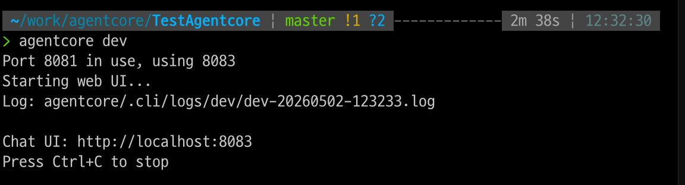

# 20260502

## aws bedrock agentcore

### 실행

1. AWS 신규 계정 생성
2. bedrock 에서 claude 설문 작성
3. 스타트 가이드 따라하기. [https://github.com/awslabs/agentcore-samples/blob/main/00-getting-started/README.md](가이드 링크)

### 참고문서
- agentcore sample getting started guide : https://github.com/awslabs/agentcore-samples/blob/main/00-getting-started/README.md
- tech blog example : https://aws.amazon.com/ko/blogs/tech/multi-agent-operations-for-airline-agentcore-service/

